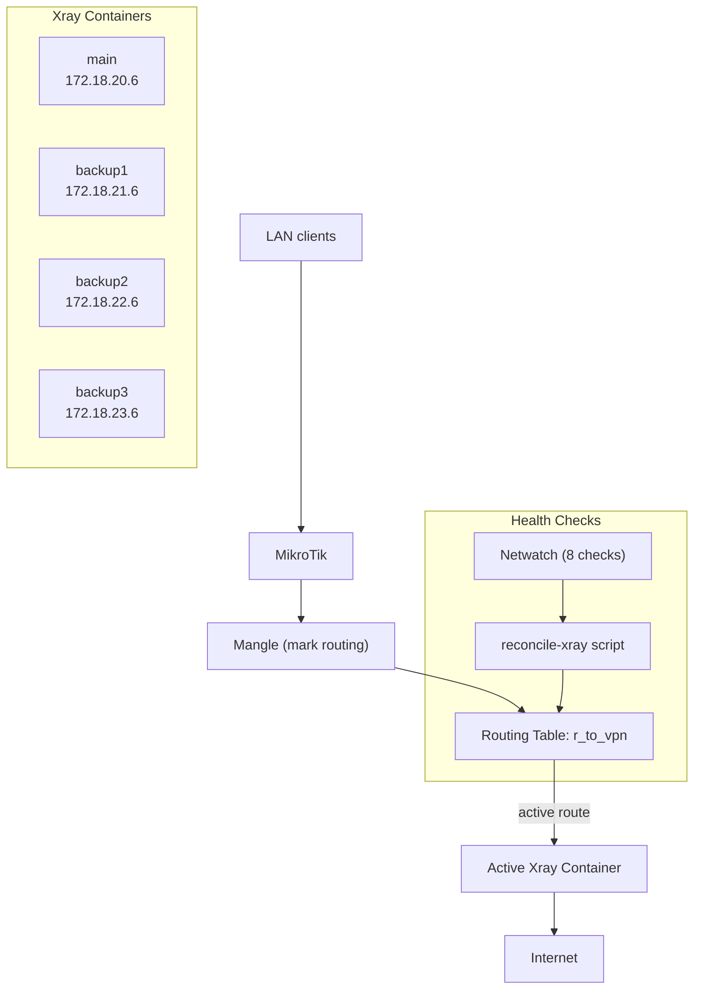

# MikroTik Xray Failover Gateway


Transparent Xray failover gateway for MikroTik RouterOS

Версия документа на русском языке: [/README.md](/README.md)

---

## Table of Contents

1. [Project Description](#1-project-description)
2. [Introduction and RouterOS Pre-configuration](#2-introduction-and-routeros-pre-configuration)
3. [Generating Xray Configs](#3-generating-xray-configs)
4. [USB Preparation and Containers](#4-usb-preparation-and-containers)
5. [Network Configuration (VETH, IP, Routes)](#5-network-configuration-veth-ip-routes)
6. [Netwatch and Health-check](#6-netwatch-and-health-check)
7. [Failover Logic (reconcile-xray)](#7-failover-logic-reconcile-xray)
8. [Scheduler](#8-scheduler)
9. [Telegram Notifications](#9-telegram-notifications)
10. [Project Structure](#10-project-structure)
11. [USB Flash Drive Cloning](#11-usb-flash-drive-cloning)
12. [Limitations](#12-limitations)
13. [FAQ / Troubleshooting](#13-faq--troubleshooting)

---

## 1. Project Description

### Overview

This guide describes the deployment of a fault-tolerant (failover) proxy gateway on MikroTik devices using Xray with VLESS + Reality + XHTTP protocols.

The solution is based on running containers inside RouterOS using a specialized Xray image adapted for MikroTik.

### Features

- Transparent proxy (no client configuration needed)
- Automatic switching between 4 Xray servers (failover)
- Automatic return to the primary server (failback)
- Policy routing via a separate routing table
- Telegram notifications on switchovers
- Runs from USB drive (portable)
- Fully autonomous operation

### Requirements

- MikroTik device with **ARM64** architecture
- RouterOS version **7.21.3** or newer
- Container support in RouterOS
  Documentation: https://help.mikrotik.com/docs/display/ROS/Container
- USB drive (recommended, ext4)

### Test Environment

Configuration tested on:
- MikroTik hAP ax3
- RouterOS 7.21.3+

### Prerequisites

Before starting, make sure that:
- Xray server-side is deployed (e.g., via [Remnawave](https://docs.rw/))
- You have **4 working connections** (subscriptions or keys) to Xray servers

### Difficulty Level

This guide is intended for intermediate-level users.

Required:
- Practical experience configuring MikroTik
- Knowledge at the **MTCNA** level

### Result

You will get a fault-tolerant proxy gateway running directly on MikroTik through the RouterOS container environment.

---

## 2. Introduction and RouterOS Pre-configuration

### 2.1. Enabling Container Support

By default, containers are disabled in RouterOS. You need to enable the `container` package:

```routeros
/system/device-mode/update container=yes
```

After this, the router will require a reboot and a physical press of the reset button for confirmation.

### 2.2. Configuring Container Registry (optional)

If you plan to pull images directly from Docker Hub:

```routeros
/container/config
set registry-url=https://registry-1.docker.io
set tmpdir=usb1-part1/container-tmp
```

> **Note:** This project uses a pre-built `.tar` image file, so the registry is not required.

If Docker Hub requires authentication, register an account at https://hub.docker.com/ and add it to MikroTik:

```routeros
/container/config/set username="your_login@domain.com" password="your_password"
```

### 2.3. DNS Configuration

Make sure MikroTik can resolve domain names:

```routeros
/ip dns
set servers=1.1.1.1,8.8.8.8 allow-remote-requests=yes
```

### 2.4. Solution Architecture



Each Xray container is connected via a separate VETH interface and has its own subnet:

| Container | VETH Interface    | Subnet          | Gateway (MikroTik) | Container IP  |
|-----------|-------------------|-----------------|-------------------|---------------|
| main      | docker-xray-veth  | 172.18.20.0/24  | 172.18.20.1       | 172.18.20.6   |
| backup1   | docker-xray-veth2 | 172.18.21.0/24  | 172.18.21.1       | 172.18.21.6   |
| backup2   | docker-xray-veth3 | 172.18.22.0/24  | 172.18.22.1       | 172.18.22.6   |
| backup3   | docker-xray-veth4 | 172.18.23.0/24  | 172.18.23.1       | 172.18.23.6   |

---

## 3. Generating Xray Configs

Before configuring containers, you need to generate 4 `config.json` files for each Xray server.

Detailed documentation: [xray-utils/readme.md](xray-utils/readme.md)

### Generation Methods

| Method   | Description                     | Link                                                        |
|----------|---------------------------------|-------------------------------------------------------------|
| Web (PHP) | Web interface, paste JSON      | https://any.hayazg.net/xray-generator.php                   |
| CLI (Python) | Command line                | [xray-generator.py](xray-utils/xray-generator.py)          |

### Steps

1. Export JSON from your Xray client (e.g., HAPP)
2. Feed it to the generator (web or CLI)
3. Download the generated `config.json`
4. Repeat for each of the 4 servers

### Placing Configs on MikroTik

Config files are stored in the router's internal memory (NAND):

```
xray-configs/config.json     <- main
xray-configs2/config.json    <- backup1
xray-configs3/config.json    <- backup2
xray-configs4/config.json    <- backup3
```

Upload files via WinBox (Files) or SCP:

```bash
scp config-main.json admin@192.168.88.1:xray-configs/config.json
scp config-backup1.json admin@192.168.88.1:xray-configs2/config.json
scp config-backup2.json admin@192.168.88.1:xray-configs3/config.json
scp config-backup3.json admin@192.168.88.1:xray-configs4/config.json
```

---

## 4. USB Preparation and Containers

### 4.1. Formatting the USB Drive

Connect the USB drive to MikroTik and format it as ext4:

```routeros
/disk format usb1 file-system=ext4 label=xray-usb mbr-partition-table=yes
```

> **Important:**
> - Always specify `usb1`, not `usb1-part1`:
>   - `usb1` --- is the physical disk
>   - `usb1-part1` --- is a partition on the disk
>   - Formatting is done on the disk, not the partition
> - `mbr-partition-table=yes` --- recommended to always set, as it creates a proper partition table, avoids mount issues, and makes behavior predictable
> - Always use **ext4** --- recommended by MikroTik. Any other allowed format may cause unpredictable issues with file and folder permissions

### 4.2. Creating Directories

On the USB Flash drive:

```routeros
/file add name=usb1-part1/xray-root type=directory
/file add name=usb1-part1/xray-root2 type=directory
/file add name=usb1-part1/xray-root3 type=directory
/file add name=usb1-part1/xray-root4 type=directory
/file add name=usb1-part1/xray-images type=directory
/file add name=usb1-part1/container-tmp type=directory
```

In MikroTik memory (NAND):

```routeros
/file add name=xray-configs type=directory
/file add name=xray-configs2 type=directory
/file add name=xray-configs3 type=directory
/file add name=xray-configs4 type=directory
```

### 4.3. Configuring tmpdir for Containers

```routeros
/container/config
set tmpdir=usb1-part1/container-tmp
```

> **Note:** `tmpdir` can be created in NAND or even on a RAM-mounted disk. However, we recommend not cluttering NAND or RAM with extra files and not risking damage to MikroTik's internal memory or RAM.

To check the current path used for containers (specifically `tmpdir`):

```routeros
/container/config/print
```

Example output:

```
[admin@ax3] > /container/config/print
    registry-url: https://registry-1.docker.io
        username: your_login@domain.com
       layer-dir:
          tmpdir: /usb1-part1/container-tmp
     memory-high: unlimited
  memory-current: 201.6MiB
```

### 4.4. Preparing the Docker Image

Detailed build instructions: [docker/readme.md](docker/readme.md)

**Quick option** --- download a pre-built image:

```bash
wget https://any.hayazg.net/xray-mikrotik-26.2.9-arm64.tar
```

Transfer the file to MikroTik USB:

```
usb1-part1/xray-images/xray-mikrotik-26.2.9-arm64.tar
```

### 4.5. Creating Mount Lists

Each container mounts its own directory with `config.json`:

```routeros
/container/mounts
add name=XRAYCFG src=xray-configs dst=/etc/xray
add name=XRAYCFG2 src=xray-configs2 dst=/etc/xray
add name=XRAYCFG3 src=xray-configs3 dst=/etc/xray
add name=XRAYCFG4 src=xray-configs4 dst=/etc/xray
```

### 4.6. Creating Containers

```routeros
/container/add \
    file=usb1-part1/xray-images/xray-mikrotik-26.2.9-arm64.tar \
    interface=docker-xray-veth \
    root-dir=usb1-part1/xray-root \
    mountlists=XRAYCFG \
    name=xray \
    logging=yes \
    start-on-boot=yes

/container/add \
    file=usb1-part1/xray-images/xray-mikrotik-26.2.9-arm64.tar \
    interface=docker-xray-veth2 \
    root-dir=usb1-part1/xray-root2 \
    mountlists=XRAYCFG2 \
    name=xray2 \
    logging=yes \
    start-on-boot=yes

/container/add \
    file=usb1-part1/xray-images/xray-mikrotik-26.2.9-arm64.tar \
    interface=docker-xray-veth3 \
    root-dir=usb1-part1/xray-root3 \
    mountlists=XRAYCFG3 \
    name=xray3 \
    logging=yes \
    start-on-boot=yes

/container/add \
    file=usb1-part1/xray-images/xray-mikrotik-26.2.9-arm64.tar \
    interface=docker-xray-veth4 \
    root-dir=usb1-part1/xray-root4 \
    mountlists=XRAYCFG4 \
    name=xray4 \
    logging=yes \
    start-on-boot=yes
```

---

## 5. Network Configuration (VETH, IP, Routes)

### 5.1. Creating VETH Interfaces

```routeros
/interface/veth
add name=docker-xray-veth address=172.18.20.6/24 gateway=172.18.20.1
add name=docker-xray-veth2 address=172.18.21.6/24 gateway=172.18.21.1
add name=docker-xray-veth3 address=172.18.22.6/24 gateway=172.18.22.1
add name=docker-xray-veth4 address=172.18.23.6/24 gateway=172.18.23.1
```

### 5.2. Assigning IP Addresses on the MikroTik Side

```routeros
/ip/address
add address=172.18.20.1/24 interface=docker-xray-veth
add address=172.18.21.1/24 interface=docker-xray-veth2
add address=172.18.22.1/24 interface=docker-xray-veth3
add address=172.18.23.1/24 interface=docker-xray-veth4
```

### 5.3. Routing Table for VPN Traffic

A separate routing table `r_to_vpn` is created:

```routeros
/routing/table
add fib name=r_to_vpn
```

### 5.4. Routes to Containers

Each route is marked with a comment for management by the `reconcile-xray` script:

```routeros
/ip/route
add dst-address=0.0.0.0/0 gateway=172.18.20.6 routing-table=r_to_vpn \
    comment=xray-main disabled=no
add dst-address=0.0.0.0/0 gateway=172.18.21.6 routing-table=r_to_vpn \
    comment=xray-backup1 disabled=yes
add dst-address=0.0.0.0/0 gateway=172.18.22.6 routing-table=r_to_vpn \
    comment=xray-backup2 disabled=yes
add dst-address=0.0.0.0/0 gateway=172.18.23.6 routing-table=r_to_vpn \
    comment=xray-backup3 disabled=yes
```

> At startup, only the `xray-main` route is active. The `reconcile-xray` script switches routes automatically.

### 5.5. Address List: RFC1918 (Private Networks)

To avoid accidentally losing access to MikroTik and prevent internal traffic from going through the VPN, create an RFC1918 address list (private subnets):

```routeros
/ip/firewall/address-list
add address=10.0.0.0/8 list=RFC1918
add address=172.16.0.0/12 list=RFC1918
add address=192.168.0.0/16 list=RFC1918
```

> **Why this is needed:** without excluding private subnets, traffic to MikroTik itself and to local devices may go through the VPN tunnel, leading to loss of router management access.

### 5.6. Mangle Rules (Policy Routing)

Rules are listed in priority order (order matters!):

```routeros
/ip/firewall/mangle
# 1. Bypass RFC1918 — pass traffic to private subnets without marking
add chain=prerouting action=accept dst-address-list=RFC1918 \
    in-interface-list=!WAN comment="Bypass RFC1918"

# 2. Mark connection — mark TCP connections from LAN for VPN
add chain=prerouting action=mark-connection new-connection-mark=to-vpn-conn \
    passthrough=yes protocol=tcp src-address=192.168.88.0/24 \
    connection-mark=no-mark comment="Mark TCP LAN to VPN"

# 3. Mark routing — route marked connections to the r_to_vpn table
add chain=prerouting action=mark-routing new-routing-mark=r_to_vpn \
    passthrough=no src-address=192.168.88.0/24 connection-mark=to-vpn-conn \
    comment="Route TCP LAN to VPN"

# 4-7. Clamp MSS — adjust MSS for each VETH interface
add chain=forward action=change-mss new-mss=1360 passthrough=yes tcp-flags=syn \
    protocol=tcp out-interface=docker-xray-veth tcp-mss=1420-65535 \
    comment="Clamp MSS to Xray"

add chain=forward action=change-mss new-mss=1360 passthrough=yes tcp-flags=syn \
    protocol=tcp out-interface=docker-xray-veth2 tcp-mss=1420-65535 \
    comment="Clamp MSS to Xray2"

add chain=forward action=change-mss new-mss=1360 passthrough=yes tcp-flags=syn \
    protocol=tcp out-interface=docker-xray-veth3 tcp-mss=1420-65535 \
    comment="Clamp MSS to Xray3"

add chain=forward action=change-mss new-mss=1360 passthrough=yes tcp-flags=syn \
    protocol=tcp out-interface=docker-xray-veth4 tcp-mss=1420-65535 \
    comment="Clamp MSS to Xray4"
```

> **Note:** replace `192.168.88.0/24` with your LAN subnet.

### 5.7. NAT for Containers

Rules are listed in priority order (order matters!):

```routeros
/ip/firewall/nat
# 0. Masquerade — NAT for outgoing traffic
add chain=srcnat action=masquerade out-interface-list=WAN \
    comment="NAT for Xray containers"

# 1. Bypass Xray DNS UDP — pass DNS UDP traffic from containers
add chain=dstnat action=accept protocol=udp src-address=172.18.0.0/16 \
    dst-port=53 comment="bypass Xray DNS UDP"

# 2. Bypass Xray DNS TCP — pass DNS TCP traffic from containers
add chain=dstnat action=accept protocol=tcp src-address=172.18.0.0/16 \
    dst-port=53 comment="bypass Xray DNS TCP"
```

---

## 6. Netwatch and Health-check

To determine the availability of each Xray server, 8 Netwatch entries are used --- 2 per container:

- **Local health-check** (`watch-local-*`) --- checks that the container is running and responding on SOCKS port 15443
- **Remote health-check** (`watch-xray-*`) --- checks the availability of the remote Xray server (IP address from the config)

### 6.1. Local Health-check (Containers)

Checking SOCKS port 15443 availability on each container:

```routeros
/tool/netwatch
add name=watch-local-main host=172.18.20.6 port=15443 type=tcp-conn \
    interval=10s timeout=2s

add name=watch-local-backup1 host=172.18.21.6 port=15443 type=tcp-conn \
    interval=10s timeout=2s

add name=watch-local-backup2 host=172.18.22.6 port=15443 type=tcp-conn \
    interval=10s timeout=2s

add name=watch-local-backup3 host=172.18.23.6 port=15443 type=tcp-conn \
    interval=10s timeout=2s
```

### 6.2. Remote Health-check (Servers)

Checking remote Xray server availability. IP addresses are filled automatically by the `update-watch-hosts` script:

```routeros
/tool/netwatch
add name=watch-xray-main host=0.0.0.0 port=443 type=tcp-conn \
    interval=15s timeout=4s \
    up-script="/system/script/run reconcile-xray" \
    down-script="/system/script/run reconcile-xray"

add name=watch-xray-backup1 host=0.0.0.0 port=443 type=tcp-conn \
    interval=15s timeout=4s \
    up-script="/system/script/run reconcile-xray" \
    down-script="/system/script/run reconcile-xray"

add name=watch-xray-backup2 host=0.0.0.0 port=443 type=tcp-conn \
    interval=15s timeout=4s \
    up-script="/system/script/run reconcile-xray" \
    down-script="/system/script/run reconcile-xray"

add name=watch-xray-backup3 host=0.0.0.0 port=443 type=tcp-conn \
    interval=15s timeout=4s \
    up-script="/system/script/run reconcile-xray" \
    down-script="/system/script/run reconcile-xray"
```

> **Note:** `port=443` --- replace with your Xray server port if different. The `host` IP address will be automatically updated by the `update-watch-hosts` script.

> **Important:** After adding Remote Netwatch entries, you need to run the script to populate IP addresses:
>
> ```routeros
> /system script run update-watch-hosts
> ```
>
> More about script installation: [7.3. Installing Scripts](#73-installing-scripts)

### 6.3. How It Works

A server is considered **UP** only if both health-checks pass:
- Local (container is running) **AND** Remote (server is reachable)

Possible statuses:

| Local | Remote | Status        | Meaning                          |
|-------|--------|---------------|----------------------------------|
| UP    | UP     | `UP`          | Everything is working            |
| DOWN  | UP     | `LOCAL_DOWN`  | Container is not responding      |
| UP    | DOWN   | `REMOTE_DOWN` | Remote server is unreachable     |
| DOWN  | DOWN   | `DOWN`        | Everything is down               |

---

## 7. Failover Logic (reconcile-xray)

### 7.1. Description

The script [`reconcile-xray.rsc`](mikrotik-scripts/reconcile-xray.rsc) --- is the main failover logic script. It is called automatically on every Netwatch status change (up/down).

A version without Telegram proxy is also available: [`reconcile-xray-without-proxy.rsc`](mikrotik-scripts/reconcile-xray-without-proxy.rsc) --- sends notifications directly to the Telegram API (suitable if MikroTik has direct access to `api.telegram.org`).

### 7.2. Algorithm

1. Checks statuses of all 8 Netwatch entries (4 local + 4 remote)
2. Determines the best available server by priority: **main > backup1 > backup2 > backup3**
3. Compares the current active route with the target
4. If the current route differs from the target:
   - Enables the route to the target container
   - Disables routes to other containers
   - Sends a Telegram notification
5. If main recovers --- automatically switches back (failback)

### 7.3. Installing Scripts

Create the scripts in RouterOS:

```routeros
/system/script
add name=reconcile-xray source=[contents of reconcile-xray.rsc file]
add name=update-watch-hosts source=[contents of update-watch-hosts.rsc file]
```

> **Important:** before adding, replace in the `reconcile-xray` script:
> - `<TELEGRAM_BOT_TOKEN>` --- your Telegram bot token
> - `<TELEGRAM_GROUP_ID>` --- group/chat ID
> - `<TELEGRAM_THREAD_ID>` --- thread ID (if using a forum)
> - `https://proxy.domain.tld` --- your Telegram proxy address (see [section 9](#9-telegram-notifications))

Script source code:
- [`reconcile-xray.rsc`](mikrotik-scripts/reconcile-xray.rsc) (via Telegram proxy)
- [`reconcile-xray-without-proxy.rsc`](mikrotik-scripts/reconcile-xray-without-proxy.rsc) (directly to Telegram)
- [`update-watch-hosts.rsc`](mikrotik-scripts/update-watch-hosts.rsc) (updating IPs in Netwatch)

### 7.4. Notification Examples

When switching, the script sends a Telegram message like:

```
XRAY_SWITCH_TO_BACKUP1
ACTIVE: XRAY1 - server1.example.com
XRAY server0.example.com - REMOTE_DOWN
XRAY1 server1.example.com - UP
XRAY2 server2.example.com - UP
XRAY3 server3.example.com - UP
```

When the primary server is restored:

```
XRAY_MAIN_RESTORED_SWITCH_BACK_TO_MAIN
ACTIVE: XRAY - server0.example.com
XRAY server0.example.com - UP
XRAY1 server1.example.com - UP
XRAY2 server2.example.com - UP
XRAY3 server3.example.com - UP
```

### 7.5. Testing

#### Simulating a Remote Xray Failure

Force-change the IP to a non-existent address:

```routeros
/tool netwatch set [find where name="watch-xray-main"] host=203.0.113.1
```

A Telegram notification about switching to backup should arrive.

Fix it --- run the IP update script:

```routeros
/system script run update-watch-hosts
```

A notification about returning to main should arrive.

#### Simulating a Local Failure (Container)

Stop the container:

```routeros
/container/stop xray
```

A Telegram notification about switching to backup should arrive.

Fix it --- start the container back:

```routeros
/container/start xray
```

A notification about returning to main should arrive.

---

## 8. Scheduler

### 8.1. update-watch-hosts Script

The script [`update-watch-hosts.rsc`](mikrotik-scripts/update-watch-hosts.rsc) automatically updates IP addresses in Netwatch based on domain names from Xray configs.

**Why this is needed:** Server IP addresses can change (DNS). The script parses the `"address"` field from each `config.json` and updates the `host` in the corresponding Netwatch entries.

Config-to-Netwatch mapping:

| Config File              | Netwatch Entry       |
|--------------------------|---------------------|
| `xray-configs/config.json`  | `watch-xray-main`    |
| `xray-configs2/config.json` | `watch-xray-backup1` |
| `xray-configs3/config.json` | `watch-xray-backup2` |
| `xray-configs4/config.json` | `watch-xray-backup3` |

### 8.2. Script Installation

```routeros
/system/script
add name=update-watch-hosts source=[contents of update-watch-hosts.rsc file]
```

### 8.3. Scheduler Configuration

Two rules: on startup and every 30 minutes:

```routeros
/system/scheduler
add name=update-hosts-on-boot on-event="/system/script/run update-watch-hosts" \
    start-time=startup interval=0

add name=update-hosts-periodic on-event="/system/script/run update-watch-hosts" \
    start-time=00:00:00 interval=30m
```

---

## 9. Telegram Notifications

The `reconcile-xray` script sends Telegram notifications on every server switchover. Since MikroTik may not have direct access to `api.telegram.org`, two options are provided:

### Option 1: Via Proxy (recommended)

Uses the script [`reconcile-xray.rsc`](mikrotik-scripts/reconcile-xray.rsc). Requires deploying a Telegram proxy on an external server.

Detailed proxy setup instructions: [Telegram-Proxy-Server.md](Telegram-Proxy-Server.md)

### Option 2: Direct

Uses the script [`reconcile-xray-without-proxy.rsc`](mikrotik-scripts/reconcile-xray-without-proxy.rsc). Suitable if MikroTik has direct access to `api.telegram.org`.

### Creating a Telegram Bot

1. Message [@BotFather](https://t.me/BotFather) on Telegram
2. Create a bot with the `/newbot` command
3. Save the received token
4. Add the bot to a group/chat
5. Get the `chat_id` and `thread_id` (if using a forum)

---

## 10. Project Structure

```
mikrotik-xray-failover/
|-- README.md                    # This documentation (Russian)
|-- README.en.md                 # This documentation (English)
|-- Telegram-Proxy-Server.md    # Telegram proxy setup guide
|-- docker/
|   |-- Dockerfile              # Xray image for MikroTik (Alpine + iptables)
|   |-- start.sh                # Entry point: iptables setup + Xray launch
|   |-- readme.md               # Docker image build instructions
|-- mikrotik-scripts/
|   |-- reconcile-xray.rsc              # Failover script (via Telegram proxy)
|   |-- reconcile-xray-without-proxy.rsc # Failover script (directly to Telegram)
|   |-- update-watch-hosts.rsc           # IP update in Netwatch from configs
|-- xray-utils/
|   |-- xray-generator.php      # Web config.json generator (PHP)
|   |-- xray-generator.py       # CLI config.json generator (Python)
|   |-- readme.md               # Generator documentation
|-- images/
|   |-- web-generator.png       # Web generator screenshot
|   |-- cli-generator.png       # CLI generator screenshot
```

### Docker Image

The Dockerfile is based on `teddysun/xray` and adds `iptables` for transparent proxy:

```dockerfile
FROM teddysun/xray:26.2.6
RUN apk add --no-cache iptables
COPY start.sh /start.sh
RUN chmod +x /start.sh
CMD ["sh", "/start.sh"]
```

Contents of `start.sh`:

```sh
#!/bin/sh
iptables -t nat -F
iptables -t nat -A PREROUTING -p tcp --dport 15443 -j RETURN
iptables -t nat -A PREROUTING -p tcp -j REDIRECT --to-ports 12345
exec /usr/bin/xray -config /etc/xray/config.json
```

The `start.sh` script on launch:
1. Flushes NAT rules
2. Passes through traffic on port 15443 (health-check)
3. Redirects all other TCP traffic to port 12345 (dokodemo-door)
4. Starts Xray

---

## 11. USB Flash Drive Cloning

We recommend making a full copy of the USB Flash drive in case the drive fails. Simply insert the clone copy instead of the failed one --- and everything works: no additional actions needed!

**STEP 1.** Download the free program [Win32 Disk Imager](https://sourceforge.net/projects/win32diskimager/) and install it on Windows.

**STEP 2.** Insert the working USB drive and create an image: **Read** --- save as, for example, `E:\xray-mikrotik\xray-backup.img`

**STEP 3.** Insert a new USB drive and write the previously saved image file: **Write** --- select `E:\xray-mikrotik\xray-backup.img`

---

## 12. Limitations

- No UDP support (dokodemo-door works with TCP only)
- WhatsApp calls on Windows may not work
- ARM64 MikroTik architecture required
- RouterOS 7.21.3+ required

---

## 13. FAQ / Troubleshooting

### Container Won't Start

```routeros
/container/print
/log print where topics~"container"
```

Check:
- Is the image format correct (built via Podman, not Docker Desktop)
- Is the image file present on USB
- Is there enough space on USB

### Netwatch Shows DOWN for All Servers

1. Check if containers are running: `/container/print`
2. Check local health-check: try connecting to the container's SOCKS port
3. Make sure `update-watch-hosts` has run: `/log print where message~"watch"`
4. Check DNS: `:resolve example.com`

### Telegram Notifications Not Arriving

1. Check proxy availability: `/tool fetch url="https://proxy.domain.tld" output=user as-value`
2. Check bot token
3. Check logs: `/log print where message~"TG"`

### Traffic Not Going Through VPN

1. Check mangle rules: `/ip/firewall/mangle/print`
2. Check active route: `/ip/route/print where routing-table=r_to_vpn`
3. Check NAT: `/ip/firewall/nat/print`

---

## License

[MIT](LICENSE)

---

## 💰 Support / Donations

If you would like to support this project and thank the developer, you can send any amount using the QR code or the link below. Thank you for your support!


**Public USDT (TRC20) address:**  
`TDotEyAfwhLMS8L8fYwkfQLNkVEA3VFKPW`

[**Trust Wallet link**](https://link.trustwallet.com/send?coin=195&address=TDotEyAfwhLMS8L8fYwkfQLNkVEA3VFKPW&token_id=TR7NHqjeKQxGTCi8q8ZY4pL8otSzgjLj6t
)
