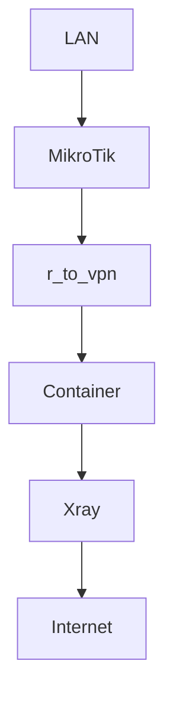

# 🚀 MikroTik Xray Failover Gateway


Transparent Xray failover gateway for MikroTik RouterOS

---

## 📚 Содержание

- [Описание проекта](#-описание)
- [Возможности](#%EF%B8%8F-возможности)
- [Преднастройка](#-2-введение-и-преднастройка-routeros)
- [Контейнеры](#-4-подготовка-флешки-и-контейнеров)
- [Failover](#-5-failover-логика)

---

## 📌 Описание

### Общее описание

Данный гайд описывает развертывание отказоустойчивого (Failover)
прокси-шлюза на устройствах MikroTik с использованием Xray и протоколов
VLESS + Reality + XHTTP.

Решение базируется на запуске контейнеров внутри RouterOS и
использовании специализированного образа Xray, адаптированного под
MikroTik.

### Требования

-   Устройство MikroTik с архитектурой **ARM64**
-   RouterOS версии **7.21.3 или новее**
-   Поддержка контейнеров в RouterOS\
    Документация: https://help.mikrotik.com/docs/display/ROS/Container

### Тестовая среда

Конфигурация протестирована на: - MikroTik hAP ax³ - RouterOS 7.21.3+

### Предварительная подготовка

Перед началом убедитесь, что: - Развернута серверная часть Xray\
(например, через Remnawave: https://docs.rw/) - У вас есть **4 рабочих
подключения** (подписки или ключи) к Xray-серверам

### Уровень сложности

⚠️ Инструкция рассчитана на пользователей среднего уровня.

Требуется: - Практический опыт настройки MikroTik - Знания на уровне
**MTCNA**

### Назначение решения

Данная схема позволяет: - Реализовать автоматическое переключение между
несколькими Xray-серверами - Повысить стабильность и отказоустойчивость
соединения - Использовать современные протоколы обхода блокировок
(Reality + XHTTP)

### Результат

В итоге вы получите отказоустойчивый прокси-шлюз, работающий
непосредственно на MikroTik через контейнерную среду RouterOS.


---

## ⚙️ Возможности
- Transparent proxy
- 🔁 Автоматическое переключение между 4 Xray серверами
- 🔄 Возврат на основной сервер
- Auto failover / failback
- Полностью автономная работа
- 🌐 Policy routing
- 📡 Transparent proxy (без настройки клиентов)
- 📢 Telegram уведомления
- 💾 Работает с USB (переносимо)

---

## ⚠️ Ограничения

- ❌ Нет UDP (dokodemo-door)
- ❌ WhatsApp calls (Windows) могут не работать

---

## 🧠 Архитектура



---

## 🐳 Containers + VETH + USB + запуск Xray

В этой схеме MikroTik выступает как прозрачный шлюз, а Xray запускается внутри контейнеров RouterOS.

Используются:

- RouterOS container subsystem
- 4 отдельных контейнера Xray
- 4 отдельных `veth` интерфейса
- USB-накопитель для хранения 4 root-dir контейнеров и tmp-файлов
- 4 отдельные директории с `config.json` в NAND (внутренней памяти) Mikrotik
- 8 `Netwatch` для local/remote health-check-ов
- 2 `Scheduler` для запуска `update-watch-hosts` при startup и каждые 30 минут
- скрипт `reconcile-xray` для выбора лучшего доступного узла
- скрипт `update-watch-hosts` для автоматическое обновление IP-адресов для Netwatch на основе доменных имён из конфигов Xray.

---

## 📦 Подготовка USB-накопителя

Рекомендуется использовать отдельную USB-флешку, отформатированную в `ext4`.

Пример форматирования:

```routeros
/disk format-drive usb1 file-system=ext4
```
Пример JSON

```json
{
  "name": "example",
  "version": "1.0",
  "enabled": true
}
```
