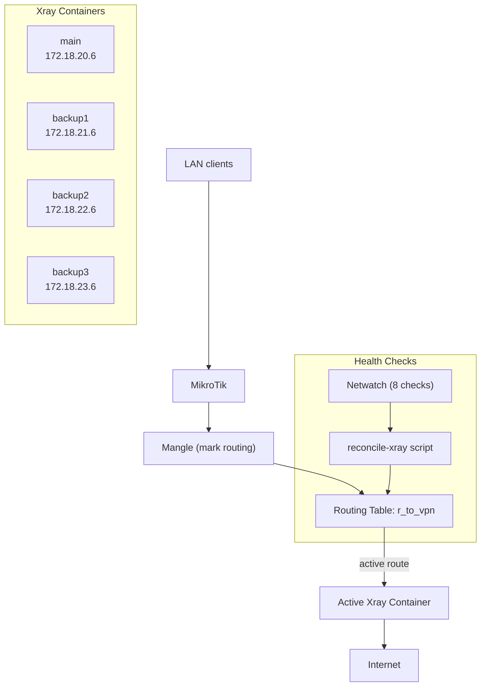

# MikroTik Xray Failover Gateway


Transparent Xray failover gateway for MikroTik RouterOS

For English version follow the link: [/README.en.md](/README.en.md)

---

## Содержание

1. [Описание проекта](#1-описание-проекта)
2. [Введение и преднастройка RouterOS](#2-введение-и-преднастройка-routeros)
3. [Генерация конфигов Xray](#3-генерация-конфигов-xray)
4. [Подготовка USB и контейнеров](#4-подготовка-usb-и-контейнеров)
5. [Настройка сети (VETH, IP, маршруты)](#5-настройка-сети-veth-ip-маршруты)
6. [Netwatch и health-check](#6-netwatch-и-health-check)
7. [Failover-логика (reconcile-xray)](#7-failover-логика-reconcile-xray)
8. [Планировщик (Scheduler)](#8-планировщик-scheduler)
9. [Telegram-уведомления](#9-telegram-уведомления)
10. [Структура проекта](#10-структура-проекта)
11. [Клонирование USB Flash-накопителя](#11-клонирование-usb-flash-накопителя)
12. [Ограничения](#12-ограничения)
13. [FAQ / Troubleshooting](#13-faq--troubleshooting)

---

## 1. Описание проекта

### Общее описание

Данный гайд описывает развертывание отказоустойчивого (failover) прокси-шлюза на устройствах MikroTik с использованием Xray и протоколов VLESS + Reality + XHTTP.

Решение базируется на запуске контейнеров внутри RouterOS и использовании специализированного образа Xray, адаптированного под MikroTik.

### Возможности

- Transparent proxy (без настройки клиентов)
- Автоматическое переключение между 4 Xray-серверами (failover)
- Автоматический возврат на основной сервер (failback)
- Policy routing через отдельную таблицу маршрутизации
- Telegram-уведомления при переключениях
- Работает с USB-накопителя (переносимо)
- Полностью автономная работа

### Требования

- Устройство MikroTik с архитектурой **ARM64**
- RouterOS версии **7.21.3** или новее
- Поддержка контейнеров в RouterOS
  Документация: https://help.mikrotik.com/docs/display/ROS/Container
- USB-накопитель (рекомендуется, ext4)

### Тестовая среда

Конфигурация протестирована на:
- MikroTik hAP ax3
- RouterOS 7.21.3+

### Предварительная подготовка

Перед началом убедитесь, что:
- или у вас развернута серверная часть Xray (например, через [Remnawave](https://docs.rw/))
- или у вас есть **4 рабочих подключения** (подписки или ключи) к Xray-серверам

### Уровень сложности

Инструкция рассчитана на пользователей среднего уровня.

Требуется:
- Практический опыт настройки MikroTik
- Знания на уровне **MTCNA**

### Результат

В итоге вы получите отказоустойчивый прокси-шлюз, работающий непосредственно на MikroTik через контейнерную среду RouterOS.

---

## 2. Введение и преднастройка RouterOS

### 2.1. Включение поддержки контейнеров

По умолчанию контейнеры отключены в RouterOS. Необходимо включить пакет `container`:

```routeros
/system/device-mode/update container=yes
```

После этого роутер потребует перезагрузку и физическое нажатие кнопки reset для подтверждения.

### 2.2. Настройка Container registry (опционально)

Если планируете загружать образы напрямую из Docker Hub:

```routeros
/container/config
set registry-url=https://registry-1.docker.io
set tmpdir=usb1-part1/container-tmp
```

> **Примечание:** В данном проекте используется готовый `.tar`-файл образа, поэтому registry не обязателен.

Если сервис Docker Hub потребует авторизации, зарегистрируйте учетную запись на https://hub.docker.com/ и добавьте ее в MikroTik:

```routeros
/container/config/set username="your_login@domain.com" password="your_password"
```

### 2.3. Настройка DNS

Убедитесь, что MikroTik может резолвить доменные имена:

```routeros
/ip dns
set servers=1.1.1.1,8.8.8.8 allow-remote-requests=yes
```

### 2.4. Архитектура решения



Каждый контейнер Xray подключен через отдельный VETH-интерфейс и имеет свою подсеть:

| Контейнер | VETH-интерфейс    | Подсеть         | Gateway (MikroTik) | IP контейнера |
|-----------|-------------------|-----------------|-------------------|---------------|
| main      | docker-xray-veth  | 172.18.20.0/24  | 172.18.20.1       | 172.18.20.6   |
| backup1   | docker-xray-veth2 | 172.18.21.0/24  | 172.18.21.1       | 172.18.21.6   |
| backup2   | docker-xray-veth3 | 172.18.22.0/24  | 172.18.22.1       | 172.18.22.6   |
| backup3   | docker-xray-veth4 | 172.18.23.0/24  | 172.18.23.1       | 172.18.23.6   |

---

## 3. Генерация конфигов Xray

Перед настройкой контейнеров необходимо сгенерировать 4 файла `config.json` для каждого Xray-сервера.

Подробная документация: [xray-utils/readme.md](xray-utils/readme.md)

### Способы генерации

| Способ   | Описание                        | Ссылка                                                      |
|----------|---------------------------------|-------------------------------------------------------------|
| Web (PHP) | Веб-интерфейс, вставить JSON   | https://any.hayazg.net/xray-generator.php                   |
| CLI (Python) | Командная строка            | [xray-generator.py](xray-utils/xray-generator.py)          |

### Порядок действий

1. Экспортируйте JSON из вашего Xray-клиента (например, HAPP)
2. Подайте его в генератор (веб или CLI)
3. Скачайте сгенерированный `config.json`
4. Повторите для каждого из 4 серверов

### Размещение конфигов на MikroTik

Файлы конфигов сохраняются во внутренней памяти (NAND) роутера:

```
xray-configs/config.json     <- main
xray-configs2/config.json    <- backup1
xray-configs3/config.json    <- backup2
xray-configs4/config.json    <- backup3
```

Загрузите файлы через WinBox (Files) или SCP:

```bash
scp config-main.json admin@192.168.88.1:xray-configs/config.json
scp config-backup1.json admin@192.168.88.1:xray-configs2/config.json
scp config-backup2.json admin@192.168.88.1:xray-configs3/config.json
scp config-backup3.json admin@192.168.88.1:xray-configs4/config.json
```

---

## 4. Подготовка USB и контейнеров

### 4.1. Форматирование USB-накопителя

Подключите USB-флешку к MikroTik и отформатируйте в ext4:

```routeros
/disk format usb1 file-system=ext4 label=xray-usb mbr-partition-table=yes
```

> **Важно:**
> - Всегда указывайте `usb1`, а не `usb1-part1`:
>   - `usb1` --- это физический диск
>   - `usb1-part1` --- это раздел на диске
>   - Форматирование выполняется по диску, а не по разделу
> - `mbr-partition-table=yes` --- рекомендуется всегда ставить, так как создает нормальную таблицу разделов, избегает проблем с mount и делает поведение предсказуемым
> - Всегда используйте **ext4** --- рекомендация MikroTik. При любом другом допустимом формате возможны непредсказуемые проблемы с правами доступа к файлам и папкам

### 4.2. Создание директорий

На USB Flash-накопителе:

```routeros
/file add name=usb1-part1/xray-root type=directory
/file add name=usb1-part1/xray-root2 type=directory
/file add name=usb1-part1/xray-root3 type=directory
/file add name=usb1-part1/xray-root4 type=directory
/file add name=usb1-part1/xray-images type=directory
/file add name=usb1-part1/container-tmp type=directory
```

В памяти MikroTik (NAND):

```routeros
/file add name=xray-configs type=directory
/file add name=xray-configs2 type=directory
/file add name=xray-configs3 type=directory
/file add name=xray-configs4 type=directory
```

### 4.3. Настройка tmpdir для контейнеров

```routeros
/container/config
set tmpdir=usb1-part1/container-tmp
```

> **Примечание:** `tmpdir` можно создать и в NAND, и даже примонтировать диск в RAM и создать там. Однако советуем не засорять ни NAND, ни RAM лишними файлами и не рисковать испортить внутреннюю память или ОЗУ MikroTik.

Чтобы посмотреть, какой путь сейчас используется для контейнеров (в частности `tmpdir`):

```routeros
/container/config/print
```

Пример вывода:

```
[admin@ax3] > /container/config/print
    registry-url: https://registry-1.docker.io
        username: your_login@domain.com
       layer-dir:
          tmpdir: /usb1-part1/container-tmp
     memory-high: unlimited
  memory-current: 201.6MiB
```

### 4.4. Подготовка Docker-образа

Подробная инструкция по сборке: [docker/readme.md](docker/readme.md)

**Быстрый вариант** --- скачать готовый образ:

```bash
wget https://any.hayazg.net/xray-mikrotik-26.2.9-arm64.tar
```

Перенести файл на USB MikroTik:

```
usb1-part1/xray-images/xray-mikrotik-26.2.9-arm64.tar
```

### 4.5. Создание mount-списков

Каждый контейнер монтирует свой каталог с `config.json`:

```routeros
/container/mounts
add name=XRAYCFG src=xray-configs dst=/etc/xray
add name=XRAYCFG2 src=xray-configs2 dst=/etc/xray
add name=XRAYCFG3 src=xray-configs3 dst=/etc/xray
add name=XRAYCFG4 src=xray-configs4 dst=/etc/xray
```

### 4.6. Создание контейнеров

```routeros
/container/add \
    file=usb1-part1/xray-images/xray-mikrotik-26.2.9-arm64.tar \
    interface=docker-xray-veth \
    root-dir=usb1-part1/xray-root \
    mountlists=XRAYCFG \
    name=xray \
    logging=yes \
    start-on-boot=yes

/container/add \
    file=usb1-part1/xray-images/xray-mikrotik-26.2.9-arm64.tar \
    interface=docker-xray-veth2 \
    root-dir=usb1-part1/xray-root2 \
    mountlists=XRAYCFG2 \
    name=xray2 \
    logging=yes \
    start-on-boot=yes

/container/add \
    file=usb1-part1/xray-images/xray-mikrotik-26.2.9-arm64.tar \
    interface=docker-xray-veth3 \
    root-dir=usb1-part1/xray-root3 \
    mountlists=XRAYCFG3 \
    name=xray3 \
    logging=yes \
    start-on-boot=yes

/container/add \
    file=usb1-part1/xray-images/xray-mikrotik-26.2.9-arm64.tar \
    interface=docker-xray-veth4 \
    root-dir=usb1-part1/xray-root4 \
    mountlists=XRAYCFG4 \
    name=xray4 \
    logging=yes \
    start-on-boot=yes
```

---

## 5. Настройка сети (VETH, IP, маршруты)

### 5.1. Создание VETH-интерфейсов

```routeros
/interface/veth
add name=docker-xray-veth address=172.18.20.6/24 gateway=172.18.20.1
add name=docker-xray-veth2 address=172.18.21.6/24 gateway=172.18.21.1
add name=docker-xray-veth3 address=172.18.22.6/24 gateway=172.18.22.1
add name=docker-xray-veth4 address=172.18.23.6/24 gateway=172.18.23.1
```

### 5.2. Назначение IP-адресов на стороне MikroTik

```routeros
/ip/address
add address=172.18.20.1/24 interface=docker-xray-veth
add address=172.18.21.1/24 interface=docker-xray-veth2
add address=172.18.22.1/24 interface=docker-xray-veth3
add address=172.18.23.1/24 interface=docker-xray-veth4
```

### 5.3. Таблица маршрутизации для VPN-трафика

Создается отдельная таблица маршрутизации `r_to_vpn`:

```routeros
/routing/table
add fib name=r_to_vpn
```

### 5.4. Маршруты к контейнерам

Каждый маршрут помечен комментарием для управления из скрипта `reconcile-xray`:

```routeros
/ip/route
add dst-address=0.0.0.0/0 gateway=172.18.20.6 routing-table=r_to_vpn \
    comment=xray-main disabled=no
add dst-address=0.0.0.0/0 gateway=172.18.21.6 routing-table=r_to_vpn \
    comment=xray-backup1 disabled=yes
add dst-address=0.0.0.0/0 gateway=172.18.22.6 routing-table=r_to_vpn \
    comment=xray-backup2 disabled=yes
add dst-address=0.0.0.0/0 gateway=172.18.23.6 routing-table=r_to_vpn \
    comment=xray-backup3 disabled=yes
```

> При старте активен только маршрут `xray-main`. Скрипт `reconcile-xray` переключает маршруты автоматически.

### 5.5. Address List: RFC1918 (частные сети)

Чтобы случайно не потерять доступ к MikroTik и не направить внутренний трафик через VPN, создайте список адресов RFC1918 (частные подсети):

```routeros
/ip/firewall/address-list
add address=10.0.0.0/8 list=RFC1918
add address=172.16.0.0/12 list=RFC1918
add address=192.168.0.0/16 list=RFC1918
```

> **Зачем это нужно:** без исключения частных подсетей трафик к самому MikroTik и к локальным устройствам может уйти в VPN-туннель, что приведет к потере управления роутером.

### 5.6. Mangle-правила (Policy Routing)

Правила перечислены в порядке приоритета (порядок важен!):

```routeros
/ip/firewall/mangle
# 1. Bypass RFC1918 — пропускаем трафик к частным подсетям без маркировки
add chain=prerouting action=accept dst-address-list=RFC1918 \
    in-interface-list=!WAN comment="Bypass RFC1918"

# 2. Mark connection — маркируем TCP-соединения из LAN для VPN
add chain=prerouting action=mark-connection new-connection-mark=to-vpn-conn \
    passthrough=yes protocol=tcp src-address=192.168.88.0/24 \
    connection-mark=no-mark comment="Mark TCP LAN to VPN"

# 3. Mark routing — направляем маркированные соединения в таблицу r_to_vpn
add chain=prerouting action=mark-routing new-routing-mark=r_to_vpn \
    passthrough=no src-address=192.168.88.0/24 connection-mark=to-vpn-conn \
    comment="Route TCP LAN to VPN"

# 4-7. Clamp MSS — корректируем MSS для каждого VETH-интерфейса
add chain=forward action=change-mss new-mss=1360 passthrough=yes tcp-flags=syn \
    protocol=tcp out-interface=docker-xray-veth tcp-mss=1420-65535 \
    comment="Clamp MSS to Xray"

add chain=forward action=change-mss new-mss=1360 passthrough=yes tcp-flags=syn \
    protocol=tcp out-interface=docker-xray-veth2 tcp-mss=1420-65535 \
    comment="Clamp MSS to Xray2"

add chain=forward action=change-mss new-mss=1360 passthrough=yes tcp-flags=syn \
    protocol=tcp out-interface=docker-xray-veth3 tcp-mss=1420-65535 \
    comment="Clamp MSS to Xray3"

add chain=forward action=change-mss new-mss=1360 passthrough=yes tcp-flags=syn \
    protocol=tcp out-interface=docker-xray-veth4 tcp-mss=1420-65535 \
    comment="Clamp MSS to Xray4"
```

> **Примечание:** замените `192.168.88.0/24` на вашу LAN-подсеть.

### 5.7. NAT для контейнеров

Правила перечислены в порядке приоритета (порядок важен!):

```routeros
/ip/firewall/nat
# 0. Masquerade — NAT для исходящего трафика
add chain=srcnat action=masquerade out-interface-list=WAN \
    comment="NAT for Xray containers"

# 1. Bypass Xray DNS UDP — пропускаем DNS UDP-трафик от контейнеров
add chain=dstnat action=accept protocol=udp src-address=172.18.0.0/16 \
    dst-port=53 comment="bypass Xray DNS UDP"

# 2. Bypass Xray DNS TCP — пропускаем DNS TCP-трафик от контейнеров
add chain=dstnat action=accept protocol=tcp src-address=172.18.0.0/16 \
    dst-port=53 comment="bypass Xray DNS TCP"
```

---

## 6. Netwatch и health-check

Для определения доступности каждого Xray-сервера используются 8 записей Netwatch --- по 2 на каждый контейнер:

- **Local health-check** (`watch-local-*`) --- проверяет, что контейнер запущен и отвечает на SOCKS-порту 15443
- **Remote health-check** (`watch-xray-*`) --- проверяет доступность удаленного Xray-сервера (IP-адрес из конфига)

### 6.1. Local health-check (контейнеры)

Проверка доступности SOCKS-порта 15443 на каждом контейнере:

```routeros
/tool/netwatch
add name=watch-local-main host=172.18.20.6 port=15443 type=tcp-conn \
    interval=10s timeout=2s

add name=watch-local-backup1 host=172.18.21.6 port=15443 type=tcp-conn \
    interval=10s timeout=2s

add name=watch-local-backup2 host=172.18.22.6 port=15443 type=tcp-conn \
    interval=10s timeout=2s

add name=watch-local-backup3 host=172.18.23.6 port=15443 type=tcp-conn \
    interval=10s timeout=2s
```

### 6.2. Remote health-check (серверы)

Проверка доступности удаленных Xray-серверов. IP-адреса заполняются автоматически скриптом `update-watch-hosts`:

```routeros
/tool/netwatch
add name=watch-xray-main host=0.0.0.0 port=443 type=tcp-conn \
    interval=15s timeout=4s \
    up-script="/system/script/run reconcile-xray" \
    down-script="/system/script/run reconcile-xray"

add name=watch-xray-backup1 host=0.0.0.0 port=443 type=tcp-conn \
    interval=15s timeout=4s \
    up-script="/system/script/run reconcile-xray" \
    down-script="/system/script/run reconcile-xray"

add name=watch-xray-backup2 host=0.0.0.0 port=443 type=tcp-conn \
    interval=15s timeout=4s \
    up-script="/system/script/run reconcile-xray" \
    down-script="/system/script/run reconcile-xray"

add name=watch-xray-backup3 host=0.0.0.0 port=443 type=tcp-conn \
    interval=15s timeout=4s \
    up-script="/system/script/run reconcile-xray" \
    down-script="/system/script/run reconcile-xray"
```

> **Примечание:** `port=443` --- замените на порт вашего Xray-сервера, если он отличается. IP-адрес `host` будет автоматически обновлен скриптом `update-watch-hosts`.

> **Важно:** После добавления Remote Netwatch-записей необходимо выполнить скрипт для заполнения IP-адресов:
>
> ```routeros
> /system script run update-watch-hosts
> ```
>
> Подробнее об установке скрипта: [7.3. Установка скриптов](#73-установка-скриптов)

### 6.3. Принцип работы

Сервер считается **UP**, только если оба health-check пройдены:
- Local (контейнер запущен) **AND** Remote (сервер доступен)

Возможные статусы:

| Local | Remote | Статус        | Значение                         |
|-------|--------|---------------|----------------------------------|
| UP    | UP     | `UP`          | Все работает                     |
| DOWN  | UP     | `LOCAL_DOWN`  | Контейнер не отвечает            |
| UP    | DOWN   | `REMOTE_DOWN` | Удаленный сервер недоступен      |
| DOWN  | DOWN   | `DOWN`        | Все недоступно                   |

---

## 7. Failover-логика (reconcile-xray)

### 7.1. Описание

Скрипт [`reconcile-xray.rsc`](mikrotik-scripts/reconcile-xray.rsc) --- основной скрипт failover-логики. Вызывается автоматически при каждом изменении статуса Netwatch (up/down).

Также доступна версия без Telegram-прокси: [`reconcile-xray-without-proxy.rsc`](mikrotik-scripts/reconcile-xray-without-proxy.rsc) --- отправляет уведомления напрямую в Telegram API (подходит, если MikroTik имеет прямой доступ к `api.telegram.org`).

### 7.2. Алгоритм

1. Проверяет статусы всех 8 Netwatch-записей (4 local + 4 remote)
2. Определяет лучший доступный сервер по приоритету: **main > backup1 > backup2 > backup3**
3. Сравнивает текущий активный маршрут с целевым
4. Если текущий маршрут отличается от целевого:
   - Включает маршрут на целевой контейнер
   - Отключает маршруты на остальные контейнеры
   - Отправляет Telegram-уведомление
5. Если main восстанавливается --- автоматически переключается обратно (failback)

### 7.3. Установка скриптов

Создайте скрипты в RouterOS:

```routeros
/system/script
add name=reconcile-xray source=[содержимое файла reconcile-xray.rsc]
add name=update-watch-hosts source=[содержимое файла update-watch-hosts.rsc]
```

> **Важно:** перед добавлением замените в скрипте `reconcile-xray`:
> - `<TELEGRAM_BOT_TOKEN>` --- токен вашего Telegram-бота
> - `<TELEGRAM_GROUP_ID>` --- ID группы/чата
> - `<TELEGRAM_THREAD_ID>` --- ID темы (если используете форум)
> - `https://proxy.domain.tld` --- адрес вашего Telegram-прокси (см. [раздел 9](#9-telegram-уведомления))

Исходный код скриптов:
- [`reconcile-xray.rsc`](mikrotik-scripts/reconcile-xray.rsc) (через Telegram-прокси)
- [`reconcile-xray-without-proxy.rsc`](mikrotik-scripts/reconcile-xray-without-proxy.rsc) (напрямую в Telegram)
- [`update-watch-hosts.rsc`](mikrotik-scripts/update-watch-hosts.rsc) (обновление IP в Netwatch)

### 7.4. Примеры уведомлений

При переключении скрипт отправляет в Telegram сообщение вида:

```
XRAY_SWITCH_TO_BACKUP1
ACTIVE: XRAY1 - server1.example.com
XRAY server0.example.com - REMOTE_DOWN
XRAY1 server1.example.com - UP
XRAY2 server2.example.com - UP
XRAY3 server3.example.com - UP
```

При восстановлении основного сервера:

```
XRAY_MAIN_RESTORED_SWITCH_BACK_TO_MAIN
ACTIVE: XRAY - server0.example.com
XRAY server0.example.com - UP
XRAY1 server1.example.com - UP
XRAY2 server2.example.com - UP
XRAY3 server3.example.com - UP
```

### 7.5. Проверка работы

#### Имитация remote-поломки Xray

Принудительно меняем IP на несуществующий адрес:

```routeros
/tool netwatch set [find where name="watch-xray-main"] host=203.0.113.1
```

Должно прийти Telegram-уведомление о переключении на backup.

Исправляем --- запускаем скрипт обновления IP:

```routeros
/system script run update-watch-hosts
```

Должно прийти уведомление о возврате на main.

#### Имитация local-поломки (контейнер)

Останавливаем контейнер:

```routeros
/container/stop xray
```

Должно прийти Telegram-уведомление о переключении на backup.

Исправляем --- запускаем контейнер обратно:

```routeros
/container/start xray
```

Должно прийти уведомление о возврате на main.

---

## 8. Планировщик (Scheduler)

### 8.1. Скрипт update-watch-hosts

Скрипт [`update-watch-hosts.rsc`](mikrotik-scripts/update-watch-hosts.rsc) автоматически обновляет IP-адреса в Netwatch на основе доменных имен из конфигов Xray.

**Зачем это нужно:** IP-адреса серверов могут меняться (DNS). Скрипт парсит поле `"address"` из каждого `config.json` и обновляет `host` в соответствующих записях Netwatch.

Соответствие конфигов и Netwatch-записей:

| Файл конфига             | Netwatch-запись      |
|--------------------------|---------------------|
| `xray-configs/config.json`  | `watch-xray-main`    |
| `xray-configs2/config.json` | `watch-xray-backup1` |
| `xray-configs3/config.json` | `watch-xray-backup2` |
| `xray-configs4/config.json` | `watch-xray-backup3` |

### 8.2. Установка скрипта

```routeros
/system/script
add name=update-watch-hosts source=[содержимое файла update-watch-hosts.rsc]
```

### 8.3. Настройка планировщика

Два правила: при старте и каждые 30 минут:

```routeros
/system/scheduler
add name=update-hosts-on-boot on-event="/system/script/run update-watch-hosts" \
    start-time=startup interval=0

add name=update-hosts-periodic on-event="/system/script/run update-watch-hosts" \
    start-time=00:00:00 interval=30m
```

---

## 9. Telegram-уведомления

Скрипт `reconcile-xray` отправляет уведомления в Telegram при каждом переключении серверов. Поскольку MikroTik может не иметь прямого доступа к `api.telegram.org`, предусмотрены два варианта:

### Вариант 1: Через прокси (рекомендуется)

Используется скрипт [`reconcile-xray.rsc`](mikrotik-scripts/reconcile-xray.rsc). Требуется развернуть Telegram-прокси на внешнем сервере.

Подробная инструкция по настройке прокси: [Telegram-Proxy-Server.md](Telegram-Proxy-Server.md)

### Вариант 2: Напрямую

Используется скрипт [`reconcile-xray-without-proxy.rsc`](mikrotik-scripts/reconcile-xray-without-proxy.rsc). Подходит, если MikroTik имеет прямой доступ к `api.telegram.org`.

### Создание Telegram-бота

1. Напишите [@BotFather](https://t.me/BotFather) в Telegram
2. Создайте бота командой `/newbot`
3. Сохраните полученный токен
4. Добавьте бота в группу/чат
5. Получите `chat_id` и `thread_id` (если используете форум)

---

## 10. Структура проекта

```
mikrotik-xray-failover/
|-- README.md                    # Данная документация
|-- Telegram-Proxy-Server.md    # Инструкция по настройке Telegram-прокси
|-- docker/
|   |-- Dockerfile              # Образ Xray для MikroTik (Alpine + iptables)
|   |-- start.sh                # Точка входа: настройка iptables + запуск Xray
|   |-- readme.md               # Инструкция по сборке Docker-образа
|-- mikrotik-scripts/
|   |-- reconcile-xray.rsc              # Failover-скрипт (через Telegram-прокси)
|   |-- reconcile-xray-without-proxy.rsc # Failover-скрипт (напрямую в Telegram)
|   |-- update-watch-hosts.rsc           # Обновление IP в Netwatch из конфигов
|-- xray-utils/
|   |-- xray-generator.php      # Веб-генератор config.json (PHP)
|   |-- xray-generator.py       # CLI-генератор config.json (Python)
|   |-- readme.md               # Документация генераторов
|-- images/
|   |-- web-generator.png       # Скриншот веб-генератора
|   |-- cli-generator.png       # Скриншот CLI-генератора
```

### Docker-образ

Dockerfile базируется на `teddysun/xray` и добавляет `iptables` для transparent proxy:

```dockerfile
FROM teddysun/xray:26.2.6
RUN apk add --no-cache iptables
COPY start.sh /start.sh
RUN chmod +x /start.sh
CMD ["sh", "/start.sh"]
```

Содержимое `start.sh`:

```sh
#!/bin/sh
iptables -t nat -F
iptables -t nat -A PREROUTING -p tcp --dport 15443 -j RETURN
iptables -t nat -A PREROUTING -p tcp -j REDIRECT --to-ports 12345
exec /usr/bin/xray -config /etc/xray/config.json
```

Скрипт `start.sh` при запуске:
1. Сбрасывает правила NAT
2. Пропускает трафик на порт 15443 (health-check)
3. Перенаправляет весь остальной TCP-трафик на порт 12345 (dokodemo-door)
4. Запускает Xray

---

## 11. Клонирование USB Flash-накопителя

Советуем сделать полную копию USB Flash-накопителя на случай, если флешка испортится. Просто вставляете копию-клон вместо испортившейся --- и все работает: ничего дополнительно делать не нужно!

**ШАГ 1.** Скачать бесплатную программу [Win32 Disk Imager](https://sourceforge.net/projects/win32diskimager/) и установить в ОС Windows.

**ШАГ 2.** Вставить рабочую USB-флешку и сделать образ: **Read** --- сохранить, например, как `E:\xray-mikrotik\xray-backup.img`

**ШАГ 3.** Вставить новую USB-флешку и записать ранее сохраненный образ-файл: **Write** --- выбрать `E:\xray-mikrotik\xray-backup.img`

---

## 12. Ограничения

- Нет поддержки UDP (dokodemo-door работает только с TCP)
- WhatsApp-звонки на Windows могут не работать
- Требуется ARM64-архитектура MikroTik
- Необходим RouterOS 7.21.3+

---

## 13. FAQ / Troubleshooting

### Контейнер не запускается

```routeros
/container/print
/log print where topics~"container"
```

Проверьте:
- Правильный ли формат образа (собран через Podman, а не Docker Desktop)
- Есть ли файл образа на USB
- Достаточно ли места на USB

### Netwatch показывает DOWN для всех серверов

1. Проверьте, запущены ли контейнеры: `/container/print`
2. Проверьте local health-check: попробуйте подключиться к SOCKS-порту контейнера
3. Убедитесь, что `update-watch-hosts` отработал: `/log print where message~"watch"`
4. Проверьте DNS: `:resolve example.com`

### Не приходят Telegram-уведомления

1. Проверьте доступность прокси: `/tool fetch url="https://proxy.domain.tld" output=user as-value`
2. Проверьте токен бота
3. Проверьте логи: `/log print where message~"TG"`

### Трафик не идет через VPN

1. Проверьте mangle-правила: `/ip/firewall/mangle/print`
2. Проверьте активный маршрут: `/ip/route/print where routing-table=r_to_vpn`
3. Проверьте NAT: `/ip/firewall/nat/print`

---

## Лицензия

[MIT](LICENSE)

---

## 💰 Финансовая поддержка / Донат

Если вы хотите поддержать проект и отблагодарить разработчика, вы можете отправить любую сумму с помощью QR-кода или по ссылке ниже. Спасибо за вашу поддержку!


**Публичный адрес для получения USDT (TRC20):**  
`TDotEyAfwhLMS8L8fYwkfQLNkVEA3VFKPW`

[**Ссылка для Trust Wallet**](https://link.trustwallet.com/send?coin=195&address=TDotEyAfwhLMS8L8fYwkfQLNkVEA3VFKPW&token_id=TR7NHqjeKQxGTCi8q8ZY4pL8otSzgjLj6t
)
